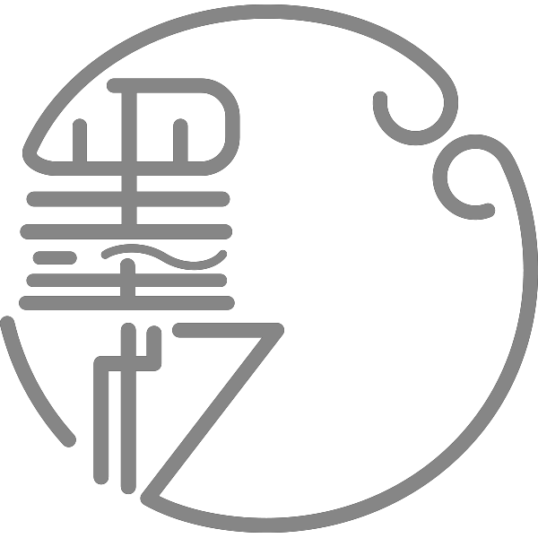

<h2 align="center">🌟项目名称: mihoyo-material</h2>
<h5 align="center">一个原神活动H5页面上有关Spine动效整理仓库</h5>
<h5 align="center">🚧 因为个人精力有限,还请希望大家一起参与,一同维护项目</h5>

    
    

## 通知
 - 目前`剪彩映虹`游戏H5因为本人等级不够的原因下载不了后面的素材文件,所以先上传部分文件,等待后续解锁完成后即可浏览所有素材
 

## ✨ mihoyo-material是什么项目？
- `mihoyo-material`是一个原神活动H5页面上有关Spine动效整理
- 里面包含`有关当前H5页面所有的素材文件`,`Spine`,`atlas`文件的提供
- 还有人物的拆分图层.

## 💡️ mihoyo-material该如何使用？
- 打开Spine软件
- 点击导入项目,选择对应的`json`文件
- 然后选择纹理解包器,选择atlas文件

## ✏️ 如何向mihoyo-material提交代码?
- 1.Fork`mihoyo-material`
- 2.维护代码~
- 3.请遵守以下提交格式:
- `🚧 Fix`,`➕ Feat`,`🔨 Refactor`,`📝 Docs`,`✨ Style`,`🍱 Perf`,`🔧 Test`,`⚡️ Chore`,`🐛 Bug`
- 4.提交到`主仓库`的修改的`相应分支`.

## ✅ 如何发送Issues?
- 请遵守以下提交格式:
- `🐛 Bug`,`✨ Style`,`🎨 Proposai`.

## 👥 本项目开发人员
- `墨忆江南 - 解包,拆分,制作spine文件`
- [墨忆江南 的 GitHub](https://github.com/Dongyifengs)

## ⚖️ 开源协议
- 本项目是面向大众的，所以我们会进行开源,请遵循相关开源协议 [BSL-1.0](https://github.com/dongyifengs/mihoyo-material/LICENSE) 的规则.
- 在BSL-1.0的基础上,禁止将本项目进行商业用途.
- 众人拾柴火焰高，开源需要依靠大家的努力，请自觉遵守开源协议，弘扬开源精神，共建开源社区！
- 仅供学习使用,请在24小时内删除,若有侵权请联系mail`1545929126@qq.com`.